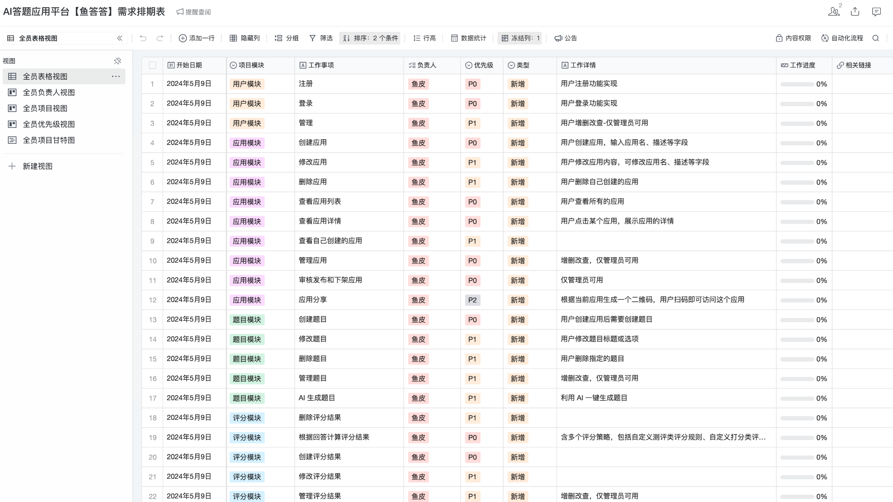

# question-well

- Review
  1. 用户中心项目: 适合新手入门，系统学习完整的项目开发流程和上线方法。
  2. 伙伴匹配系统: 巩固开发流程，学习 Redis、事务、并发编程、大数据推荐思想等后端知识。
  3. API 开放平台: 学习实践前后端模板开发 + 架构设计 + SDK 开发 + API 签名认证 + Dubbo RPc+ Gateway微服务网关。
  4. 手写 RPC 框架: 从 0到1开发轮子，实践网络协议设计 + 序列化 + Etcd 注册中心 + Vert.x 服务器 + 动态代理 + SPI 机制 + 负载均衡 + 服务重试容镨机制 + 注解驱动启动器，大幅提升架构设计能力。
  5. 聚合搜索平台: 学习实践爬虫 + Elastic Stack + 设计模式 + 数据同步 + JMeter 压力测试
  6. 智能 BI 项目: 学习实践异步化 + 线程池 + RabbitMQ 消息队列 + AI 应用开发 + AIGC Prompt 优化。
  7. 判题系统: 学习实践前后端模板开发 + 多种设计模式 + 单体项目微服务改造 + Linux 虛拟机远程开发 + Docker 代码沙箱 + Java 安全控制。
  8. 代码生成器共享平台: 深入业务场景，学习实践命令行开发、模板引擎、Vert.x、设计模式、对象存储、性能优化、存储优化、系统设计、分布式任务调度系统等。


- Reference

  [yupi github](https://github.com/liyupi/yudada), [yupi note](https://bcdh.yuque.com/staff-wpxfif/resource/tllk10dnzp6g3q3y), [yupi note code-nav](https://www.code-nav.cn/course/1782335162700775426/section/1788149836286005250?type=), [yupi note code-nav](https://www.code-nav.cn/course/1790274408835506178),  
  
  [zhipuAI](https://open.bigmodel.cn/), [xunfei spark](https://xinghuo.xfyun.cn/sparkapi), [Yu Smart](https://www.yucongming.com/), 
  
  [Taro](https://taro-docs.jd.com/docs/)、[Taro UI](https://taro-ui.jd.com/#/), 
  
  [vuejs org](https://cn.vuejs.org/), [arco design (component vue)](https://arco.design/vue/docs/start), [Pinia](https://pinia.vuejs.org/zh/getting-started.html)


## 背景介绍

- 项目三大阶段 (选题新颖、业务真实完整)

  第一阶段，开发本地的 `MBTI性格测试小程序`。熟悉答题应用的开发流程，实战跨端小程序开发。

  第二阶段，上升一个层次，开发 `答题应用平台`。用户可以通过上传题目和自定义打分规则，创建答题应用，供其他用户使用。(前后端全栈项目从0到1的开发)

  第三阶段，让AI为平台赋能，做一个 `AI智能答题应用平台` 。用户只需设定主题，就能通过 AI 生成题目、用 AI分析用户答案，极大降低创建答题应用的成本。

- 项目优势

  业务真实新颖 (答题应用 AI平台)、技术主流新颖 (前后端 AI)、

  能学到东西 (CRUD 实际业务场景 系统设计优化 企业级解决方案)、

  教程资料少 (调研)、增加竞争力 (响应式编程 分库分表 设计模式 性能及稳定性优化)

- 项目收获 (通用的项目开发方法和架构设计套路)

  如何拆解复杂业务，从0开始设计实现系统？

  如何快速开发小程序、响应式网站和后端项目？

  如何巧用 JSON 实现复杂评分策略？

  如何巧妙利用设计模式来优化代码？

  如何利用 Al工具 CodeGeex 智能编程助手 提高开发效率？

  如何利用 SSE 技术实时推送通知？

  如何利用 Redis + Caffeine + 分布式锁实现稳定高效的缓存？

  如何使用 RxJava 多线程提升服务性能？

  如何实现业务的幂等性保证？

  如何运用分库分表优化系统？

  


### 业务梳理

- 核心业务流程

  

  

- 时序图

  

  


- 项目功能梳理

- 小程序

  在线答题

- 平台

  用户模块：注册、登录、管理用户-增删改查 (仅管理员可用)

  应用模块：

  - 创建应用(名称、描述、上传图片、应用类型)、修改应用(用户)、
  - 审核发布和下架应用(管理员)、管理应用-增删改查(管理员)、应用分享(扫码查看)

  题目模块：创建题目(名称、选项)、修改题目、删除题目、AI生成题目

  评分模块：多种评分策略、创建评分结果、题目得分设置

  回答模块：提交选择、回答记录、AI分析总结回答

  统计分析模块

  


- 技术选型

- 开发工具

  WebStorm、IDEA、CodeGeeX、

- 前端web网页开发

  Vue 3、Vue-CLl 脚手架、Pinia 状态管理、Axios 请求库、Arco Design 组件库、

  前端工程化：ESLint + Prettier +TypeScript、

  富文本编辑器、QRCode.js 二维码生成、OpenAPl前端代码生成

- 前端小程序开发

  React、Taro 跨端开发框架、Taro UI 组件库

- 后端

  Java Spring Boot 开发框架(万用后端模板)、

  存储层：MySQL数据库 + Redis 缓存 + 腾讯云COS对象存储

  MyBatis-Plus及MyBatis X自动生成

  Redission 分布式锁

  Caffeine 本地缓存

  ✔基于 ChatGLM 大模型实现 AI 能力

  ✔RxJava 响应式框架+多线程/线程池实战

  ✔Shardingsphere 分库分表+分布式ID 雪花算法

  ✔SSE 服务端推送

  ✔多种设计模式

  ✔多角度项目优化：性能、稳定性、幂等性优化等


- 架构设计

  

  


### 产品概念

- 参考产品

- MBTI

  界面设计、业务流程

  [16personalities](https://www.16personalities.com/ch)

  

  

- MBTI实现方案 (总结)

  核心组成：题目、用户答案、评分规则
  
  


- 题目结构 (JSON) 

  优点：相比与 拿选项作为key，结构更清晰、更易于理解和扩展、前后端都可以声明类型 (更灵活 排序)

  缺点：占用空间，可以进行数据预处理

  ```json
  [
      {
          "title": "你通常更喜欢",
          "options": [
              {
                  "result": "I",
                  "value": "独自工作",
                  "key": "A"
              },
              {
                  "result": "E",
                  "value": "与他人合作",
                  "key": "B"
              }
          ]
      }
  ]
  ```

- 用户答案(JSON) 

  优点：按顺序匹配题目 不用完整传输题目 节省体积

  ```json
  ["A", "A", "B"]
  ```

- 评分规则!!!

  [Myers-Briggs Type Indicator](https://zh.wikipedia.org/wiki/%E9%82%81%E7%88%BE%E6%96%AF-%E5%B8%83%E9%87%8C%E6%A0%BC%E6%96%AF%E6%80%A7%E6%A0%BC%E5%88%86%E9%A1%9E%E6%B3%95): binary classification * 4

  每个结果都有一个 resultProp，是一个元素不重复的数组 (属性集合)，里面的内容和题目选项的result字段匹配

  ```
  例如说
  
  用户第一题选A，对应属性是I；那么遍历16中结果人格，若人格包含I，则该人格就+1分，不包含则不得分
  
  遍历完所有题目，就得出16种人格的得分，得分最高的人格为最终结果
  
  ```

- 评分结果 (16种人格)

  ```json
  [
    {
      "resultProp": [
        "I",
        "S",
        "T",
        "J"
      ],
      "resultDesc": "忠诚可靠，被公认为务实，注重细节。",
      "resultPicture": "icon_url_istj",
      "resultName": "ISTJ（物流师）"
    },
    {
      "resultProp": [
        "I",
        "S",
        "F",
        "J"
      ],
      "resultDesc": "善良贴心，以同情心和责任为特点。",
      "resultPicture": "icon_url_isfj",
      "resultName": "ISFJ（守护者）"
    },
  ]
  ```

  


- 小程序开发

  小程序和网页开发 (一致性)

  - 在线热更新、调试、版本兼容、打包上线
  - 部署简单

  小程序开发优点：

  - 基于微信生态，易于传播分享
  - 不让用户下载APP，快速打开

  小程序开发痛点：

  - 一些权限和功能必须要求企业号

- 小程序开发的技术选型

  [Taro 跨端开发框架](https://taro-docs.jd.com/docs/)、[Taro UI 组件库 (推荐 兼容)](https://taro-ui.jd.com/#/)、nut UI

  React、TypeScript

  [微信开发者工具](https://developers.weixin.qq.com/miniprogram/dev/devtools/download.html)

  


## 环境搭建

- 环境说明

  JDK(8, 11, 17), MySQL 8.x, [Redis 5.x](https://github.com/zkteco-home/redis-windows/releases)

  [nodejs18.x,](https://nodejs.org/en) npm 9.x

  [CodeGeeX](https://codegeex.cn/)


### 项目初始化 (小程序)

- 参考

  [用这个方法开发小程序 video](https://www.bilibili.com/video/BV1vM4m1R7K3/)、[小程序开发指南 240327 note](https://www.code-nav.cn/course/1782335162700775426/section/1782342928001646593?type=#heading-0)

  [Taro guide](https://taro-docs.jd.com/docs/GETTING-STARTED)


- Taro guide

  ```bash
  cd /d/code2/java-code/yudada/
  npm install -g @tarojs/cli
  taro -V  # 3!!!
  
  taro init mbti-test-mini
  ? 请输入项目介绍
  ? 请选择框架 React
  ? 是否需要使用 TypeScript ？ Yes
  ? 请选择 CSS 预处理器（Sass/Less/Stylus） Sass
  ? 请选择编译工具 Webpack5
  ? 请选择包管理工具 npm
  ? 请选择模板源 Gitee（最快）
  ✔ 拉取远程模板仓库成功！
  ? 请选择模板 taro-ui（使用 taro-ui 的模板）
  
  
  npm install --force
  npm run dev:weapp  # 开发
  npm run build:weapp  # 构建发布 (打包优化压缩)
  
  ```
  
- Configure the development specifications for the project

  `eslint`, `typescript`: 校验js代码、提供语法提示的工具 (纠正编码习惯)

  `prettier`: 代码美化、快速格式化代码工具

  `settings` -> `eslint` -> `automatic ESLint configuration`

  `settings` -> `prettier` -> `automatic prettier configuration`

  .eslintrc 

  ```
  {
    "extends": [
      "taro/react"
    ],
    "rules": {
      "react/jsx-uses-react": "off",
      "react/react-in-jsx-scope": "off",
      "jsx-quotes": "off"
    }
  }
  
  ```

- To import Taro UI components globally ([reference](https://taro-ui.jd.com/#/docs/quickstart))

  


### 后端项目初始化

- 后端初始化模板 (重复功能不重复开发)

  [完善企业级周边系统 2024-04-18](https://bcdh.yuque.com/staff-wpxfif/resource/yvmx2pim5tu6nqla#)、[后端 Spring Boot 万用模板使用](https://bcdh.yuque.com/staff-wpxfif/resource/chd1fh1knmrmh2fz)、[Java 后端万用项目模板](https://bcdh.yuque.com/staff-wpxfif/resource/gz47w7)

  ```bash
  cp -r springboot-init/ question-well/
  cd question-well/
  mv springboot-init/ java-question-well/
  
  mysql -uroot -p123456
  create database questionwell;
  
  ```

- 模板介绍

  [reference](https://github.com/Time1043/gonna-oj/blob/main/README.md#%E5%90%8E%E7%AB%AF%E9%A1%B9%E7%9B%AE%E7%BB%93%E6%9E%84) `README.md`

  CodeGeneration

- 准备依赖

  依赖文件、配置文件

  `MySQL 8.x` ✔, `Redis` (default off) ✔, `Elasticsearch` (default off), `COS` (do not affect)

  ```bash
  # http://localhost:8101/api/doc.html
  # http://localhost:8101/api/doc.html#/default/user-controller/userRegisterUsingPOST
  # http://localhost:8101/api/doc.html#/default/user-controller/userLoginUsingPOST
  
  ```

- 改造项目

  全局替换：`springboot-init` -> `java-question-well`

  全局替换：`springbootinit` -> `questionwell` (包名替换：`com.time1043.questionwell`)

  移除不必要模块：ES、公众号微信、表格处理、定时任务 (删依赖 删除报错!!!)

  pom.xml: elasticsearch, wx

  application.yml: Elasticsearch, 

  全局搜索：`elasticsearch`

  ```
  cd src/main/java/com/time1043/questionwell/
  rm -rf wxmp/
  ...
  
  ```

  


### 前端项目初始化

- 技术选型

  Vue 3, Vue-CLI 脚手架, Pinia 状态管理, Axios 请求库, Arco Design 组件库

  前端工程化 ESlint + Prettier + TypeScript

  富文本编辑器, QRCodejs 二维码生成, OpenAPI 前端代码生成


- 确认环境

  ```bash
  node -v  # 18 or 16
  npm -v  # 9.5.1  
  
  
  # if need 
  npm cache clean --force
  npm install -g npm@9.5.1
  
  ```

- 创建项目：[vue-cli](https://cli.vuejs.org/zh/guide/) (稳定)

  ```bash
  cd /d/code2/java-code/question-well
  
  npm install -g @vue/cli  # 脚手架工具
  vue -V  # 5.0.8
  vue create question-well-frontend  # 创建项目
  
  
  # 选择自定义
  Vue CLI v5.0.8
  ? Please pick a preset:
    Default ([Vue 3] babel, eslint)
    Default ([Vue 2] babel, eslint) 
  > Manually select features ✔
  
  # 创建项目的选项
  Vue CLI v5.0.8
  ? Please pick a preset: Manually select features
  ? Check the features needed for your project: Babel, TS, Router, Linter
  ? Choose a version of Vue.js that you want to start the project with 3.x
  ? Use class-style component syntax? No
  ? Use Babel alongside TypeScript (required for modern mode, auto-detected polyfills, transpiling JSX)? Yes
  ? Use history mode for router? (Requires proper server setup for index fallback in production) Yes
  ? Pick a linter / formatter config: Prettier
  ? Pick additional lint features: Lint on save
  ? Where do you prefer placing config for Babel, ESLint, etc.? In dedicated config files
  ? Save this as a preset for future projects? (y/N) n
  
  
  cd question-well-frontend && npm run serve  # 先运行
  
  ```

- 前端工程化配置

  脚手架已配置：代码美化、自动校验、格式化插件 (无需自己配置)

  但是WebStorm的格式化和`.eslintrc.js`不适配：

  settings -> prettier -> prettier package选上、run for files`{**/*,*}.{js,ts,jsx,tsx,vue}`、on reformat code 打勾

  settings -> eslint -> automatic eslint configuration

  


- 引入组件库

  ```bash
  npm install --save-dev @arco-design/web-vue
  
  ```

  main.ts (完整引入)

  ```typescript
  import { createApp } from "vue";
  import App from "./App.vue";
  import ArcoVue from "@arco-design/web-vue";
  import "@arco-design/web-vue/dist/arco.css";
  import router from "./router";
  
  createApp(App).use(ArcoVue).use(router).mount("#app");
  
  ```

  App.vue (验证是否成功)  [Badge](https://arco.design/vue/component/badge)

  ```vue
      <a-badge :count="9">
        <a-avatar shape="square" />
      </a-badge>
  ```
  
  


- 定义开发规范 (团队统一 利于维护)

  选择1：配置式 (不推荐)

  定义对象，写键值对 

  ```vue
  export default defineComponent({
    name: "HomeView",
    components: {
      HelloWorld,
    },
  });
  ```

  选择2：[组合式API](https://cn.vuejs.org/guide/introduction.html#api-styles) (推荐)

  `<script setup>` js顺序

  ```vue
  <template>
    <div id="home">
      {{ a }}
    </div>
  </template>
  
  
  <script setup lang="ts">
  const a = 1;
  </script>
  
  
  <style scoped>
  #home {
    color: red;
  }
  </style>
  
  ```

  


## 小程序开发

- 小程序的配置信息

  `project.config.json`：给小程序开发工具的

  `app.config.ts`：项目对小程序的信息


- 开发页面

  路由注册 (`app.config.ts`)、复制已有页面；

  定制开发 (页面 + 样式 + js逻辑交互)

- 页面规划

  主页、答题页面、结果页面

  [图片生成 AI绘画](https://www.yucongming.com/draw)

  

- dir

  ```bash
  touch types/custom.d.ts
  
  cd src/ && mkdir -p assets/ components/GlobalFooter/ data/ utils/
  
  ```
  
  


- React 函数式组件 (推荐)

  ```react
  export default () => {
    return (
      <View className="index">
        <Text>User Center!</Text>
  
        <AtButton
          type="primary"
          onClick={() => {
            Taro.navigateTo({
              url: "/pages/index/index",
            });
          }}
        >
          跳转页面
        </AtButton>
      </View>
    );
  };
  
  ```
  
  React 类组件 (像java 继承...)

  ```react
  export default class Index extends Component<PropsWithChildren> {
    componentDidMount() {}
  
    componentWillUnmount() {}
  
    componentDidShow() {}
  
    componentDidHide() {}
  
    render() {
      return (
        <View className="index">
          <Text>User Center!</Text>
  
          <AtButton
            type="primary"
            onClick={() => {
              Taro.navigateTo({
                url: "/pages/index/index",
              });
            }}
          >
            跳转页面
          </AtButton>
        </View>
      );
    }
  }
  
  ```
  
  


### 三个简单页面

- index

  页面：[背景图片(媒体)](https://taro-docs.jd.com/docs/components/media/image)、[文字标题](https://taro-ui.jd.com/#/docs/article)、[按钮](https://taro-ui.jd.com/#/docs/button)；(找组件 多丑都行)

- doQuestion

  页面：[单选框](https://taro-ui.jd.com/#/docs/radio)、...

  ```
  上一题下一题 -> 改变题号 -> 题目内容的变化 (一个变量驱动另一个变量的变化 `useEffect`)
  
  查看结果 -> 携带答案到结果页面
  
  ```

- result

  页面 (像index)

- 三个页面之间的跳转

  [路由跳转](https://taro-docs.jd.com/docs/router#%E8%B7%AF%E7%94%B1%E8%B7%B3%E8%BD%AC)  `Taro.navigateTo` (页面的叠加), `Taro.reLaunch` (关闭历史页面 打开新页面)

  


- 三个简单页面

- index

  ```tsx
  import { Image, View } from "@tarojs/components";
  import { AtButton } from "taro-ui";
  
  import "./index.scss";
  // eslint-disable-next-line import/first
  import Taro from "@tarojs/taro";
  import headerBg from "../../assets/headerBg.png";
  import GlobalFooter from "../../components/GlobalFooter";
  
  /**
   * Home Page
   */
  export default () => {
    return (
      <View className="indexPage">
        <View className="at-article__h1 title">MBTI Personality Test</View>
        <View className="at-article__h2 subTitle">
          In just 2 minutes, you can describe who you are and your personality
          traits very accurately
        </View>
  
        <AtButton
          type="primary"
          className="enterBtn"
          onClick={() => {
            Taro.navigateTo({
              url: "/pages/doQuestion/index",
            });
          }}
        >
          Start Test
        </AtButton>
  
        <Image src={headerBg} mode="widthFix" className="headerBg" />
  
        <GlobalFooter />
      </View>
    );
  };
  
  ```

- doQuestion

  ```tsx
  import { View } from "@tarojs/components";
  
  import "./index.scss";
  // eslint-disable-next-line import/first
  import GlobalFooter from "../../components/GlobalFooter";
  // eslint-disable-next-line import/first
  import { AtButton, AtRadio } from "taro-ui";
  // eslint-disable-next-line import/first
  import { useEffect, useState } from "react";
  import questions from "../../data/questions.json";
  import Taro from "@tarojs/taro";
  
  /**
   * Home Page
   */
  export default () => {
    // Current title sequence number (starts from 1)
    const [current, setCurrent] = useState<number>(1);
  
    // const [currentQuestion, setCurrentQuestion] = useState<Question>(questions[0]);
    const currentQuestion = questions[0];
    const questionOptions = currentQuestion.options.map((option) => {
      return { label: `${option.key}. ${option.value}`, value: option.key };
    });
  
    const [currentAnswer, setCurrentAnswer] = useState<string>();
    const [answerList] = useState<string[]>([]); // history, submit
  
    // Current title sequence number -> current question
    useEffect(() => {
      setCurrentQuestion(questions[current - 1]);
      setCurrentAnswer(answerList[current - 1]);
    }, [current]);
  
    return (
      <View className="doQuestionPage">
        {/*{JSON.stringify(answerList)}*/}
        <View className="at-article__h2 subTitle">
          {current}. {currentQuestion.title}
        </View>
  
        <View className="options-wrapper">
          <AtRadio
            options={questionOptions}
            value={currentAnswer}
            onClick={(value) => {
              setCurrentAnswer(value);
              answerList[current - 1] = value; // record
            }}
          />
        </View>
  
        {current < questions.length && (
          <AtButton
            type="primary"
            className="controlBtn"
            disabled={!currentAnswer}
            onClick={() => setCurrent(current + 1)}
          >
            Next Question
          </AtButton>
        )}
  
        {current === questions.length && (
          <AtButton
            type="primary"
            className="controlBtn"
            disabled={!currentAnswer}
            onClick={() => {
              // send data
  
              // route to result page
              Taro.navigateTo({
                url: "/pages/result/index",
              });
            }}
          >
            View Final Results
          </AtButton>
        )}
  
        {current > 1 && (
          <AtButton
            type="primary"
            className="controlBtn"
            onClick={() => setCurrent(current - 1)}
          >
            Previous Question
          </AtButton>
        )}
  
        <GlobalFooter />
      </View>
    );
  };
  
  ```

- result

  ```tsx
  import { Image, View } from "@tarojs/components";
  
  import "./index.scss";
  // eslint-disable-next-line import/first
  import headerBg from "../../assets/headerBg.png";
  import GlobalFooter from "../../components/GlobalFooter";
  // eslint-disable-next-line import/first
  import { AtButton } from "taro-ui";
  // eslint-disable-next-line import/first
  import Taro from "@tarojs/taro";
  import questions from "../../data/questions.json";
  import questionResults from "../../data/question_results.json";
  // import {getBestQuestionResult} from "../../utils/bizUtils";
  
  /**
   * Result Page
   */
  export default () => {
    const answerList = Taro.getStorageSync("answerList");
    // const result = getBestQuestionResult(answerList);
    const result = questionResults[0];
  
    return (
      <View className="resultPage">
        <View className="at-article__h1 title">{result.resultName}</View>
        <View className="at-article__h2 subTitle">{result.resultDesc}</View>
  
        <AtButton
          type="primary"
          className="enterBtn"
          onClick={() =>
            Taro.reLaunch({
              url: "/pages/index/index",
            })
          }
        >
          Back to Home Page
        </AtButton>
  
        <Image src={headerBg} mode="widthFix" className="headerBg" />
  
        <GlobalFooter />
      </View>
    );
  };
  
  ```
  
  


- 类型约束

  types/custom.d.ts

  ```typescript
  interface QuestionOption<T extends string = string> {
    result: T;
    value: string;
    key: T;
  }
  
  interface Question<T extends string = string> {
    title: string;
    options: QuestionOption<T>[];
  }
  
  ```

  


### 评分逻辑

- 实现判题逻辑 (AI Prompt)

  请根据我下面的题目评分算法原理，帮我用js获取到得分最高的题目评分结果，要求算法清晰易懂，性能要求高，多补充一些注释。

  用户提交的答案 answerList:["A"]

  题目列表 questions: 

  ```json
  [
      {
          "title": "你通常更喜欢",
          "options": [
              {
                  "result": "I",
                  "value": "独自工作",
                  "key": "A"
              },
              {
                  "result": "E",
                  "value": "与他人合作",
                  "key": "B"
              }
          ]
      }
  ]
  ```

  题目评分结果 question_results: 

  ```json
  [
    {
      "resultProp": [
        "I",
        "S",
        "T",
        "J"
      ],
      "resultDesc": "忠诚可靠，被公认为务实，注重细节。",
      "resultPicture": "icon_url_istj",
      "resultName": "ISTJ（物流师）"
    },
  ]
  ```

  评分原理：答案数组的每个元素和题目数组中每个元素的某个选项的key对应，从而获取对应result属性；题目评分结果的resultProp集合中如果包含该属性，就+1分，最后计算哪个评分结果(question_result)分数最高

  


- 评分逻辑的实现

  src/utils/bizUtils.ts

  ```typescript
  /**
   * 获取最佳题目评分结果
   * @param answerList
   * @param questions
   * @param question_results
   */
  
  export function getBestQuestionResult(answerList, questions, question_results) {
    // 初始化一个对象，用于存储每个选项的计数
    const optionCount = {};
  
    // 用户选择 A, B, C
    // 对应 result：I, I, J
    // optionCount[I] = 2; optionCount[J] = 1
  
    // 遍历题目列表
    for (const question of questions) {
      // 遍历答案列表
      for (const answer of answerList) {
        // 遍历题目中的选项
        for (const option of question.options) {
          // 如果答案和选项的key匹配
          if (option.key === answer) {
            // 获取选项的result属性
            const result = option.result;
  
            // 如果result属性不在optionCount中，初始化为0
            if (!optionCount[result]) {
              optionCount[result] = 0;
            }
  
            // 在optionCount中增加计数
            optionCount[result]++;
          }
        }
      }
    }
  
    // 初始化最高分数和最高分数对应的评分结果
    let maxScore = 0;
    let maxScoreResult = question_results[0];
  
    // 遍历评分结果列表
    for (const result of question_results) {
      // 计算当前评分结果的分数
      const score = result.resultProp.reduce((count, prop) => {
        return count + (optionCount[prop] || 0);
      }, 0);
  
      // 如果分数高于当前最高分数，更新最高分数和最高分数对应的评分结果
      if (score > maxScore) {
        maxScore = score;
        maxScoreResult = result;
      }
    }
  
    // 返回最高分数和最高分数对应的评分结果
    return maxScoreResult;
  }
  
  // Test (example)
  const answerList = ["B","B","B","A"];
  const questions = [
    {
      title: "你通常更喜欢",
      options: [
        {
          result: "I",
          value: "独自工作",
          key: "A",
        },
        {
          result: "E",
          value: "与他人合作",
          key: "B",
        },
      ],
    },
    {
      options: [
        {
          result: "S",
          value: "喜欢有结构和常规",
          key: "A",
        },
        {
          result: "N",
          value: "喜欢自由和灵活性",
          key: "B",
        },
      ],
      title: "对于日常安排",
    },
    {
      options: [
        {
          result: "P",
          value: "首先考虑可能性",
          key: "A",
        },
        {
          result: "J",
          value: "首先考虑后果",
          key: "B",
        },
      ],
      title: "当遇到问题时",
    },
    {
      options: [
        {
          result: "T",
          value: "时间是一种宝贵的资源",
          key: "A",
        },
        {
          result: "F",
          value: "时间是相对灵活的概念",
          key: "B",
        },
      ],
      title: "你如何看待时间",
    },
  ];
  const question_results = [
    {
      resultProp: ["I", "S", "T", "J"],
      resultDesc: "忠诚可靠，被公认为务实，注重细节。",
      resultPicture: "icon_url_istj",
      resultName: "ISTJ（物流师）",
    },
    {
      resultProp: ["I", "S", "F", "J"],
      resultDesc: "善良贴心，以同情心和责任为特点。",
      resultPicture: "icon_url_isfj",
      resultName: "ISFJ（守护者）",
    },
  ];
  
  console.log(getBestQuestionResult(answerList, questions, question_results));
  
  ```

  测试

  ```bash
  cd src/utils/
  node bizUtils.ts 
  
  ```

  


### 页面间的数据传递

- 需求：题目结果页面 需要得到 做题页面用户选择的答案列表，才能进行评分。

  方法1：[url params](https://taro-docs.jd.com/docs/apis/route/navigateTo) 比如：`result?answerList=[A,B,C]`

  方法 2：[全局状态](https://taro-docs.jd.com/docs/context#contextprovider) (比较复杂的前端)

  方法 3：[本地数据存储](https://taro-docs.jd.com/docs/apis/storage/setStorageSync) (推荐 较为简单)

  


- doQuestion -> result

  doQuestion `setStorageSync` 
  
  ```tsx
        {current === questions.length && (
          <AtButton
            type="primary"
            className="controlBtn"
            disabled={!currentAnswer}
            onClick={() => {
              // send data
              Taro.setStorageSync("answerList", answerList);
              // route to result page
              Taro.navigateTo({
                url: "/pages/result/index",
              });
            }}
          >
            View Final Results
          </AtButton>
        )}
  ```
  
  result `getStorageSync` [Toast](https://taro-docs.jd.com/docs/apis/ui/interaction/showToast)
  
  ```tsx
  export default () => {
    // from doQuestion page
    const answerList = Taro.getStorageSync("answerList");
    // error
    if (!answerList || answerList.length < 1) {
      Taro.showToast({
        title: "answerList is empty",
        icon: "error",
        duration: 3000,
      });
    }
    
    // get best question result
    const result = getBestQuestionResult(answerList, questions, questionResults);
  
    return (
      <View className="resultPage">
        <View className="at-article__h1 title">{result.resultName}</View>
        <View className="at-article__h2 subTitle">{result.resultDesc}</View>
  ```
  
  


### 小程序开发的限制

- 微信开发者工具 本身bug

  清理工具缓存、重启项目、重启开发者工具

  


- 常用解决方案

  [Reference](https://www.code-nav.cn/course/1782335162700775426/section/1788149836286005250?type=#heading-34)

  小程序的调试和发布

  网络请求：请求库 (不能用Axios)、请求代码生成、全局请求处理器

  状态管理：全局js变量 (不熟悉前端的推荐)

  用户登录：

  开发规范：

  


### 扩展思路

- 定位

  题目都是固定的，不需要后端

- 扩展

  [Reference](http://sssch.net/ArticleDetail.aspx?ArticleID=13188130318) 


## 后端开发

### 功能模块梳理 

- 用户模块

  注册、登录 `P0`

  管理用户 - 增删改查 (仅管理员) `P1`

- 应用模块

  创建应用 `P0`、修改应用、删除应用 `P1`、

  查看应用列表、查看应用详情 `P0`、查看自己创建的应用 `P1`、

  管理应用 - 增删改查 (仅管理员) `P0`

  审核发布和下架应用 (仅管理员) `P0`

  应用分享 (扫码查看) `P2`

- 题目模块

  创建题目 (题目 选项 得分设置) `P0`、修改题目、删除题目 `P1`、

  管理题目 - 增删改查 (仅管理员) `P1`、 

  AI生成题目 `P1`

- 评分模块

  创建评分结果 `P0`、修改评分结果、删除评分结果 `P1`、

  根据回答计算评分结果 (多种评分策略)

  - 自定义规则评分 (测评分类 考试得分) `P0`
  - AI评分 `P1`

  管理评分结果 - 增删改查 (仅管理员) `P1`

- 回答模块

  提交回答 (创建)、查看某次回答的评分结果 `P0`、查看自己提交的回答列表 `P1`、

  管理回答 - 增删改查 (仅管理员) `P1`

- 统计分析模块

  应用评分结果分析和查看 `P2`

  


- 关注核心业务流程

  1. 用户：注册 -> 登录
  2. 用户：创建应用 -> 创建题目 (题目 选项 得分) -> 创建评分规则 (评分策略 评分结果)
  3. 管理员：管理应用、审核发布下架应用
  4. 用户：查看和检索应用列表，进入应用详情页，在线答题并提交回答
  5. 经过评分模块计算后，用户可查看本次评分结果

  


- 确定需求优先级

  `P0` 为核心，非做不可

  `P1` 为重点功能，最好做

  `P2` 为实用功能，有空就做

  `P3` 可做可不做，时间充裕再做

  


### 库表设计

- 对应功能梳理的模块 (统计模块 稍后)

  模块：用户模块、应用模块；题目模块、评分模块、回答模块

  库表：用户表、应用表；题目表、评分结果表、用户答题记录表

  ```bash
  # create_table.sql  init_data.sql
  
  mysql -uroot -p123456
  
  show databases;
  create database questionwell;
  use questionwell;
  
  ```

  


- 用户表

  ```sql
  -- 用户表
  create table if not exists user
  (
      id           bigint auto_increment comment 'id' primary key,
      userAccount  varchar(256)                           not null comment '账号',
      userPassword varchar(512)                           not null comment '密码',
      
      unionId      varchar(256)                           null comment '微信开放平台id',
      mpOpenId     varchar(256)                           null comment '公众号openId',
      
      userName     varchar(256)                           null comment '用户昵称',
      userAvatar   varchar(1024)                          null comment '用户头像',
      userProfile  varchar(512)                           null comment '用户简介',
      
      userRole     varchar(256) default 'user'            not null comment '用户角色：user/admin/ban',
      createTime   datetime     default CURRENT_TIMESTAMP not null comment '创建时间',
      updateTime   datetime     default CURRENT_TIMESTAMP not null on update CURRENT_TIMESTAMP comment '更新时间',
      isDelete     tinyint      default 0                 not null comment '是否删除',
      index idx_unionId (unionId)
  ) comment '用户' collate = utf8mb4_unicode_ci;
  ```

- 应用表

  重点是 `appType` 和 `scoringStrategy`

  加索引 (最容易被用户作为搜索条件) `appName` 

  ```sql
  -- 应用表
  create table if not exists app
  (
      id              bigint auto_increment comment 'id' primary key,
      appName         varchar(128)                       not null comment '应用名',
      appDesc         varchar(2048)                      null comment '应用描述',
      appIcon         varchar(1024)                      null comment '应用图标',
      
      appType         tinyint  default 0                 not null comment '应用类型（0-得分类，1-测评类）',
      scoringStrategy tinyint  default 0                 not null comment '评分策略（0-自定义，1-AI）',
      
      reviewStatus    int      default 0                 not null comment '审核状态：0-待审核, 1-通过, 2-拒绝',
      reviewMessage   varchar(512)                       null comment '审核信息',
      reviewerId      bigint                             null comment '审核人 id',
      reviewTime      datetime                           null comment '审核时间',
      
      userId          bigint                             not null comment '创建用户 id',
      createTime      datetime default CURRENT_TIMESTAMP not null comment '创建时间',
      updateTime      datetime default CURRENT_TIMESTAMP not null on update CURRENT_TIMESTAMP comment '更新时间',
      isDelete        tinyint  default 0                 not null comment '是否删除',
      index idx_appName (appName)
  ) comment '应用' collate = utf8mb4_unicode_ci;
  ```

  通用审核字段

  ```sql
      reviewStatus    int      default 0                 not null comment '审核状态：0-待审核, 1-通过, 2-拒绝',
      reviewMessage   varchar(512)                       null comment '审核信息',
      reviewerId      bigint                             null comment '审核人 id',
      reviewTime      datetime                           null comment '审核时间',
  ```

  


- 题目表

  **每个应用**对应**一个题目表的记录**，使用 `questionContent` 这一JSON字段，整体更新和维护该应用的题目列表、选项信息

  好处：排序题号更改 (json数据更改 容易比 数据库更新order字段)、创建应用基本信息 和 添加具体题目 在业务上是分开的

  ```sql
  -- 题目表
  create table if not exists question
  (
      id              bigint auto_increment comment 'id' primary key,
      questionContent text                               null comment '题目内容（json格式）',
      
      appId           bigint                             not null comment '应用 id',
      userId          bigint                             not null comment '创建用户 id',
      
      createTime      datetime default CURRENT_TIMESTAMP not null comment '创建时间',
      updateTime      datetime default CURRENT_TIMESTAMP not null on update CURRENT_TIMESTAMP comment '更新时间',
      isDelete        tinyint  default 0                 not null comment '是否删除',
      index idx_appId (appId)
  ) comment '题目' collate = utf8mb4_unicode_ci;
  ```

  questionContent.json  (注意区分 `result` 和 `score` 分别用于统计两种不同类型的结果)

  ```json
  [
      {
          "options": [
              {
                  "result": "I",  // 若测评类 则用result来保存答案属性
                  "score": 1,  // 若得分类 则用score来设置本题分数
                  "value": "A选项",  // 选项内容
                  "key": "A"  // 选项key
              },
              {
                  "result": "E",  // 若测评类 则用result来保存答案属性
                  "score": 0, 
                  "value": "B选项",  
                  "key": "B"  
              }
          ],
          "title": "题目..."
      }
  ]
  ```

- 评分结果表

  用户提交答案后，会获得一定的回答评定 (例如ISTJ之类的)，评分结果表就是存储这些数据的表

  ```sql
  -- 评分结果表
  create table if not exists scoring_result
  (
      id               bigint auto_increment comment 'id' primary key,
      resultName       varchar(128)                       not null comment '结果名称，如物流师',
      resultDesc       text                               null comment '结果描述',
      resultPicture    varchar(1024)                      null comment '结果图片',
      
      resultProp       varchar(128)                       null comment '结果属性集合 JSON，如 [I,S,T,J]',
      resultScoreRange int                                null comment '结果得分范围，如 80，表示 80及以上的分数命中此结果',
      
      appId            bigint                             not null comment '应用 id',
      userId           bigint                             not null comment '创建用户 id',
      
      createTime       datetime default CURRENT_TIMESTAMP not null comment '创建时间',
      updateTime       datetime default CURRENT_TIMESTAMP not null on update CURRENT_TIMESTAMP comment '更新时间',
      isDelete         tinyint  default 0                 not null comment '是否删除',
      index idx_appId (appId)
  ) comment '评分结果' collate = utf8mb4_unicode_ci;
  ```

  不同类型的应用使用不同的字段，测评类用 `resultProp`，得分类用 `resultScoreRange`

  测评类应用  resultProp.json (结果属性集合)

  ```json
  ["I", "S", "T", "J"]
  ```

  得分类应用  默认resultScoreRange字段的规则为 “>=设定的分数 则命中对应的result”

  ```sql
  INSERT INTO scoring_result (id, resultName, resultDesc, resultPicture, resultProp, resultScoreRange, createTime, updateTime, isDelete, appId, userId) VALUES 
  (17, '首都知识大师', '你真棒棒哦，首都知识非常出色！', null, null, 9, '2024-04-25 15:05:44', '2024-05-09 12:28:21', 0, 2, 1), 
  (18, '地理小能手！', '你对于世界各国的首都了解得相当不错，但还有一些小地方需要加强哦！', null, null, 7, '2024-04-25 15:05:44', '2024-05-09 12:28:21', 0, 2, 1), 
  (19, '继续加油！', '还需努力哦', null, null, 0, '2024-04-25 15:05:44', '2024-05-09 12:28:21', 0, 2, 1);
  
  ```

- 用户答题记录表

  ```sql
  -- 用户答题记录表
  create table if not exists user_answer
  (
      id              bigint auto_increment primary key,
      appId           bigint                             not null comment '应用 id',
      appType         tinyint  default 0                 not null comment '应用类型（0-得分类，1-角色测评类）',
      scoringStrategy tinyint  default 0                 not null comment '评分策略（0-自定义，1-AI）',
      
      choices         text                               null comment '用户答案（JSON 数组）',
      
      resultId        bigint                             null comment '评分结果 id',
      resultName      varchar(128)                       null comment '结果名称，如物流师',
      resultDesc      text                               null comment '结果描述',
      resultPicture   varchar(1024)                      null comment '结果图标',
      resultScore     int                                null comment '得分',
      
      userId          bigint                             not null comment '用户 id',
      
      createTime      datetime default CURRENT_TIMESTAMP not null comment '创建时间',
      updateTime      datetime default CURRENT_TIMESTAMP not null on update CURRENT_TIMESTAMP comment '更新时间',
      isDelete        tinyint  default 0                 not null comment '是否删除',
      index idx_appId (appId),
      index idx_userId (userId)
  ) comment '用户答题记录' collate = utf8mb4_unicode_ci;
  
  ```

  Q1：为什么要有冗余字段？

  `resultId`; `resultName`, `resultDesc`, `resultPicture`, `resultScore`

  因为回答记录一旦设置，几乎不会更改；便于查询，不用联表，节约开发成本

  还有可能通过异步的方式、或题目答案没提交 (只答到一半)，先临时保存回答记录

  Q2：`resultId` 可能为空

  因为AI分析策略不会从 结果表 中选取结果

  还有可能通过异步的方式、或题目答案没提交 (只答到一半)，先临时保存回答记录

  Q3：choices.json (题目选项的key数组)

  只存储选项的优点，可以节约存储空间

  但缺点是，应用的题目如果发生修改，就对应不上了

  ```json
  ["A", "B", "C"]
  ```

  可以更严谨一些，对应题目的id (或题目编号 题目的key)

  ```json
  {
      1: "A",
      2: "B"
  }
  ```

  


## 后端开发基础 (CRUD)

- 总览：5 table 最基础的增删改查，不包含复杂的业务逻辑

  数据库访问层 代码生成 `MyBatis-X` (除了user 除了service)

  业务逻辑层 代码生成 `CodeGenerator` (Controller, Service 接口和实现类, 数据模型包装类和枚举类)

  数据模型开发

  接口开发 controller (简单的直接在这完成)

  服务开发 service

  Swagger接口文档测试
  
  


### 数据库访问层 (mapper model.entity)

- 生成代码

- 修改细节 

  主键生成策略 递增 -> 雪花算法 `@TableId(type = IdType.ASSIGN_ID)`

  逻辑删除 `@TableLogic`

  


### 业务逻辑层 数据模型开发 (service controller model.vo model.dto)

- 生成代码

  基于帖子 (资源) 的通用模板

  数据库的封装类、相应给前端的封装类

  应用表、题目表、回答表、评分表

  ```java
          // 指定生成参数
          String packageName = "com.time1043.questionwell";
          String dataName = "应用";
          String dataKey = "app";
          String upperDataKey = "App";
  
          // 指定生成参数
          String packageName = "com.time1043.questionwell";
          String dataName = "题目";
          String dataKey = "question";
          String upperDataKey = "Question";
  
          // 指定生成参数
          String packageName = "com.time1043.questionwell";
          String dataName = "评分结果";
          String dataKey = "scoringResult";
          String upperDataKey = "ScoringResult";
  
          // 指定生成参数
          String packageName = "com.time1043.questionwell";
          String dataName = "用户答案";
          String dataKey = "userAnswer";
          String upperDataKey = "UserAnswer";
  
  ```

  


- 修改数据模型

- model.enums 枚举类 (应用类型 评分策略 审核状态)

  定义枚举字段、根据数据库字段获取枚举值的方法(遍历所有枚举值 判断用户传的是哪个现有枚举值)、获取所有枚举值列表(给前端)、get方法

- model.dto 封装类 (前端的增删改查接口 先复制再删除)

  `edit` (给用户用的)  `update` (给管理员用的)

  创建app：(id系统生成不用填)、`应用名`、`应用描述`、`应用图标`、`应用类型`、`评分策略`；(审核...不能给用户填)；(创建用户 创建时间 更新时间 不能给用户填)

  编辑app：`id`、`应用名`、`应用描述`、`应用图标`、`应用类型`、`评分策略`

  查询app：`id`、`应用名`、`应用描述`、`应用图标`、`应用类型`、`评分策略`；`审核状态`、`审核信息`、`审核人id`；`创建用户id`、`id`、`搜索词`

  修改app：`id`、`应用名`、`应用描述`、`应用图标`、`应用类型`、`评分策略`；`审核状态`、`审核信息`、`审核人id`、`审核时间`；(创建用户 创建时间 更新时间 不能给管理员改)
  
  QuestionContentDTO
  
  创建question：
  
  编辑question：
  
  查询question：
  
  修改question：
  
  创建scoringResult：
  
  编辑scoringResult：
  
  查询scoringResult：
  
  修改scoringResult：
  
  创建userAnswer：
  
  编辑userAnswer：
  
  查询userAnswer：
  
  修改userAnswer：
  
- model.vo 后端相应给前端的视图类

  AppVO  关联查询 用户信息

  QuestionVO 

  ScoringResultVO

  UserAnswerVO


- 对JSON结构生成dto包装类 (题目内容 结果属性集合list 用户答案list)

  入库再转JSON

  根据示例数据生成Java代码 AI

  


### 接口开发 服务开发

- 整合代码

  AppController -> AppService -> AppServiceImpl

  QuestionController -> QuestionService -> QuestionServiceImpl

  ScoringResultController -> ScoringResultService -> ScoringResultServiceImpl

  UserAnswerController -> UserAnswerService -> UserAnswerServiceImpl


- 测试

  ```bash
  # http://localhost:8101/api/doc.html
  
  # http://localhost:8101/api/doc.html#/default/app-controller/addAppUsingPOST
  # http://localhost:8101/api/doc.html#/default/app-controller/getAppVOByIdUsingGET
  # http://localhost:8101/api/doc.html#/default/app-controller/listAppByPageUsingPOST
  
  ```

  


### 通用模块

- 上传图片：结果图片、应用图片 

  FileController, FileUploadBizEnum (定义枚举)


## 后端核心业务

- 总览

  应用模块：审核发布和下架应用 (仅管理员) `P0`

  评分模块：根据回答计算评分结果 (多种评分策略 测评类 打分类) `P0`

  回答模块：提交回答 (创建) `P0` 需要额外调整 提交回答后就可以调用评分模块 并更新回答表

- 计划

  应用审核功能 (通用)

  评分模块实现 (策略接口 两种策略实现 全局执行器) 

  回答模块：UserAnswerController 调用评分模块 并更新回答表

  控制应用可见范围：若应用未过审，用户无法答题，无法通过列表查看到 (业务逻辑!)

  


### 应用审核功能 (通用)

- 审核请求类 (参数 返回值)

  审核状态、审核信息；审核人、审核时间 (不需要用户填)

  ```java
  package com.time1043.questionwell.common;
  
  import lombok.Data;
  
  import java.io.Serializable;
  
  /**
   * 审核请求
   */
  @Data
  public class ReviewRequest implements Serializable {
  
      /**
       * id
       */
      private Long id;
  
      /**
       * 状态：0-待审核, 1-通过, 2-拒绝
       */
      private Integer reviewStatus;
  
      /**
       * 审核信息
       */
      private String reviewMessage;
  
  
      private static final long serialVersionUID = 1L;
  }
  ```

- 审核接口

  ```java
      /**
       * 应用审核
       *
       * @param reviewRequest
       * @param request
       * @return
       */
      @PostMapping("/review")
      @AuthCheck(mustRole = UserConstant.ADMIN_ROLE)
      public BaseResponse<Boolean> doAppReview(@RequestBody ReviewRequest reviewRequest, HttpServletRequest request) {
          ThrowUtils.throwIf(reviewRequest == null, ErrorCode.PARAMS_ERROR);
          Long id = reviewRequest.getId();
          Integer reviewStatus = reviewRequest.getReviewStatus();
          // 校验
          ReviewStatusEnum reviewStatusEnum = ReviewStatusEnum.getEnumByValue(reviewStatus);
          if (id == null || reviewStatusEnum == null) {
              throw new BusinessException(ErrorCode.PARAMS_ERROR);
          }
          // 判断是否存在
          App oldApp = appService.getById(id);
          ThrowUtils.throwIf(oldApp == null, ErrorCode.NOT_FOUND_ERROR);
          // 已是该状态
          if (oldApp.getReviewStatus().equals(reviewStatus)) {
              throw new BusinessException(ErrorCode.PARAMS_ERROR, "请勿重复审核");
          }
          // 更新审核状态
          User loginUser = userService.getLoginUser(request);
          App app = new App();
          app.setId(id);
          app.setReviewStatus(reviewStatus);
          app.setReviewMessage(reviewRequest.getReviewMessage());
          app.setReviewerId(loginUser.getId());
          app.setReviewTime(new Date());
          boolean result = appService.updateById(app);
          ThrowUtils.throwIf(!result, ErrorCode.OPERATION_ERROR);
          return ResultUtils.success(true);
      }
  ```

  


### 评分模块实现 !!!

- 需求：针对不同的应用类别和评分策略，编写不同的实现逻辑

- 实现：策略模式 (设计模式)

  定义一系列算法，并将每个算法封装到独立的类中，使得他们可以相互替换

  将所有代码放到 `scoring` 包中，模块化

  本场景中，输入的参数是一致的 (应用 用户的答案列表)，并且每种实现逻辑区别较大，很适合用策略模式

  `function getBestQuestionResult(answerList, app.questions, app.question_results) -> maxScoreResult`

  

  

- 策略接口

  ```java
  package com.time1043.questionwell.scoring;
  
  import com.time1043.questionwell.model.entity.App;
  import com.time1043.questionwell.model.entity.UserAnswer;
  
  import java.util.List;
  
  /**
   * 评分策略
   */
  public interface ScoringStrategy {
  
      /**
       * 执行评分
       *
       * @param choices
       * @param app
       * @return
       * @throws Exception
       */
      UserAnswer doScore(List<String> choices, App app) throws Exception;
  }
  ```

  


- 测评类策略的实现类 (先写注释)

  根据 id 查询到题目和题目结果信息

  统计用户每个选择对应的属性个数，如 I = 10 个，E = 5 个

  遍历每种评分结果，计算哪个结果的得分更高

  构造返回值，填充答案对象的属性

  ```java
  package com.time1043.questionwell.scoring;
  
  import cn.hutool.json.JSONUtil;
  import com.baomidou.mybatisplus.core.toolkit.Wrappers;
  import com.time1043.questionwell.model.dto.question.QuestionContentDTO;
  import com.time1043.questionwell.model.entity.App;
  import com.time1043.questionwell.model.entity.Question;
  import com.time1043.questionwell.model.entity.ScoringResult;
  import com.time1043.questionwell.model.entity.UserAnswer;
  import com.time1043.questionwell.model.vo.QuestionVO;
  import com.time1043.questionwell.service.AppService;
  import com.time1043.questionwell.service.QuestionService;
  import com.time1043.questionwell.service.ScoringResultService;
  
  import javax.annotation.Resource;
  import java.sql.Wrapper;
  import java.util.HashMap;
  import java.util.List;
  import java.util.Map;
  
  /**
   * 自定义测评类应用的评分策略
   */
  public class CustomTestScoringStrategy implements ScoringStrategy {
      @Resource
      private QuestionService questionService;
  
      @Resource
      private ScoringResultService scoringResultService;
  
      @Override
      public UserAnswer doScore(List<String> choices, App app) throws Exception {
          Long appId = app.getId();
  
          // 1. 根据 id 查询到题目和题目结果信息
          Question question = questionService.getOne(
                  Wrappers.lambdaQuery(Question.class).eq(Question::getAppId, appId)
          );
          List<ScoringResult> scoringResultList = scoringResultService.list(
                  Wrappers.lambdaQuery(ScoringResult.class).eq(ScoringResult::getAppId, appId)
          );
  
  
          // 2. 统计用户每个选择对应的属性个数，如 I = 10 个，E = 5 个
          // 初始化一个Map，用于存储每个选项的计数
          Map<String, Integer> optionCount = new HashMap<>();
  
          QuestionVO questionVO = QuestionVO.objToVo(question);
          List<QuestionContentDTO> questionContent = questionVO.getQuestionContent();
  
          // 遍历题目列表
          for (QuestionContentDTO questionContentDTO : questionContent) {
              // 遍历答案列表
              for (String answer : choices) {
                  // 遍历题目中的选项
                  for (QuestionContentDTO.Option option : questionContentDTO.getOptions()) {
                      // 如果答案和选项的key匹配
                      if (option.getKey().equals(answer)) {
                          // 获取选项的result属性
                          String result = option.getResult();
  
                          // 如果result属性不在optionCount中，初始化为0
                          if (!optionCount.containsKey(result)) {
                              optionCount.put(result, 0);
                          }
  
                          // 在optionCount中增加计数
                          optionCount.put(result, optionCount.get(result) + 1);
                      }
                  }
              }
          }
  
  
          // 3. 遍历每种评分结果，计算哪个结果的得分更高
          // 初始化最高分数和最高分数对应的评分结果
          int maxScore = 0;
          ScoringResult maxScoringResult = scoringResultList.get(0);
  
          // 遍历评分结果列表
          for (ScoringResult scoringResult : scoringResultList) {
              List<String> resultProp = JSONUtil.toList(scoringResult.getResultProp(), String.class);
              // 计算当前评分结果的分数，[I, E] => [10, 5] => 15
              int score = resultProp.stream()
                      .mapToInt(prop -> optionCount.getOrDefault(prop, 0))
                      .sum();
  
              // 如果分数高于当前最高分数，更新最高分数和最高分数对应的评分结果
              if (score > maxScore) {
                  maxScore = score;
                  maxScoringResult = scoringResult;
              }
          }
  
  
          // 4. 构造返回值，填充答案对象的属性
          UserAnswer userAnswer = new UserAnswer();
          userAnswer.setAppId(appId);
          userAnswer.setAppType(app.getAppType());
          userAnswer.setScoringStrategy(app.getScoringStrategy());
          userAnswer.setChoices(JSONUtil.toJsonStr(choices));
          userAnswer.setResultId(maxScoringResult.getId());
          userAnswer.setResultName(maxScoringResult.getResultName());
          userAnswer.setResultDesc(maxScoringResult.getResultDesc());
          userAnswer.setResultPicture(maxScoringResult.getResultPicture());
          return userAnswer;
      }
  }
  
  ```

  


- 得分类策略的实现类

  根据 id 查询到题目和题目结果信息（按分数**降序排序**）

  统计用户的总得分

  遍历得分结果，找到第一个用户分数大于得分范围的结果，作为最终结果

  构造返回值，填充答案对象的属性

  ```java
  package com.time1043.questionwell.scoring;
  
  import cn.hutool.json.JSONUtil;
  import com.baomidou.mybatisplus.core.toolkit.Wrappers;
  import com.time1043.questionwell.model.dto.question.QuestionContentDTO;
  import com.time1043.questionwell.model.entity.App;
  import com.time1043.questionwell.model.entity.Question;
  import com.time1043.questionwell.model.entity.ScoringResult;
  import com.time1043.questionwell.model.entity.UserAnswer;
  import com.time1043.questionwell.model.vo.QuestionVO;
  import com.time1043.questionwell.service.QuestionService;
  import com.time1043.questionwell.service.ScoringResultService;
  
  import javax.annotation.Resource;
  import java.util.List;
  import java.util.Optional;
  
  /**
   * 自定义打分类应用的评分策略
   */
  public class CustomScoreScoringStrategy implements ScoringStrategy {
  
      @Resource
      private QuestionService questionService;
  
      @Resource
      private ScoringResultService scoringResultService;
  
      @Override
      public UserAnswer doScore(List<String> choices, App app) throws Exception {
          Long appId = app.getId();
          
          // 1. 根据 id 查询到题目和题目结果信息（按分数降序排序）
          Question question = questionService.getOne(
                  Wrappers.lambdaQuery(Question.class).eq(Question::getAppId, appId)
          );
          List<ScoringResult> scoringResultList = scoringResultService.list(
                  Wrappers.lambdaQuery(ScoringResult.class)
                          .eq(ScoringResult::getAppId, appId)
                          .orderByDesc(ScoringResult::getResultScoreRange)
          );
  
  
          // 2. 统计用户的总得分
          int totalScore = 0;
          QuestionVO questionVO = QuestionVO.objToVo(question);
          List<QuestionContentDTO> questionContent = questionVO.getQuestionContent();
  
          // 遍历题目列表
          for (QuestionContentDTO questionContentDTO : questionContent) {
              // 遍历答案列表
              for (String answer : choices) {
                  // 遍历题目中的选项
                  for (QuestionContentDTO.Option option : questionContentDTO.getOptions()) {
                      // 如果答案和选项的key匹配
                      if (option.getKey().equals(answer)) {
                          int score = Optional.of(option.getScore()).orElse(0);
                          totalScore += score;
                      }
                  }
              }
          }
  
  
          // 3. 遍历得分结果，找到第一个用户分数大于得分范围的结果，作为最终结果
          ScoringResult maxScoringResult = scoringResultList.get(0);
          for (ScoringResult scoringResult : scoringResultList) {
              if (totalScore >= scoringResult.getResultScoreRange()) {
                  maxScoringResult = scoringResult;
                  break;
              }
          }
  
  
          // 4. 构造返回值，填充答案对象的属性
          UserAnswer userAnswer = new UserAnswer();
          userAnswer.setAppId(appId);
          userAnswer.setAppType(app.getAppType());
          userAnswer.setScoringStrategy(app.getScoringStrategy());
          userAnswer.setChoices(JSONUtil.toJsonStr(choices));
          userAnswer.setResultId(maxScoringResult.getId());
          userAnswer.setResultName(maxScoringResult.getResultName());
          userAnswer.setResultDesc(maxScoringResult.getResultDesc());
          userAnswer.setResultPicture(maxScoringResult.getResultPicture());
          userAnswer.setResultScore(totalScore);
          return userAnswer;
      }
  }
  
  ```

  


- 方便外层调用 (封装)

  工具类 管理类 全局执行器

  工厂模式 ...

- 方法1：编程式，所有的代码配置信息都在代码里，简单直接一个文件

  `ScoringStrategyContext` ( `@Deprecated`)

  ```java
  package com.time1043.questionwell.scoring;
  
  import com.time1043.questionwell.common.ErrorCode;
  import com.time1043.questionwell.exception.BusinessException;
  import com.time1043.questionwell.model.entity.App;
  import com.time1043.questionwell.model.entity.UserAnswer;
  import com.time1043.questionwell.model.enums.AppScoringStrategyEnum;
  import com.time1043.questionwell.model.enums.AppTypeEnum;
  import org.springframework.stereotype.Service;
  
  import javax.annotation.Resource;
  import java.util.List;
  
  @Service
  @Deprecated
  public class ScoringStrategyContext {
  
      @Resource
      private CustomScoreScoringStrategy customScoreScoringStrategy;
  
      @Resource
      private CustomTestScoringStrategy customTestScoringStrategy;
  
      /**
       * 评分
       *
       * @param choiceList
       * @param app
       * @return
       * @throws Exception
       */
      public UserAnswer doScore(List<String> choiceList, App app) throws Exception {
          AppTypeEnum appTypeEnum = AppTypeEnum.getEnumByValue(app.getAppType());
          AppScoringStrategyEnum appScoringStrategyEnum = AppScoringStrategyEnum.getEnumByValue(app.getScoringStrategy());
          if (appTypeEnum == null || appScoringStrategyEnum == null) {
              throw new BusinessException(ErrorCode.SYSTEM_ERROR, "应用配置有误，未找到匹配的策略");
          }
          // 根据不同的应用类别和评分策略，选择对应的策略执行
          switch (appTypeEnum) {
              case SCORE:
                  switch (appScoringStrategyEnum) {
                      case CUSTOM:
                          return customScoreScoringStrategy.doScore(choiceList, app);
                      case AI:
                          break;
                  }
                  break;
              case TEST:
                  switch (appScoringStrategyEnum) {
                      case CUSTOM:
                          return customTestScoringStrategy.doScore(choiceList, app);
                      case AI:
                          break;
                  }
                  break;
          }
          throw new BusinessException(ErrorCode.SYSTEM_ERROR, "应用配置有误，未找到匹配的策略");
      }
  }
  
  ```

- 方法2：声明式，customScoreScoringStrategy : SCORE - CUSTOM (参数 注解)

  `ScoringStrategyConfig`

  ```java
  package com.time1043.questionwell.scoring;
  
  import org.springframework.stereotype.Component;
  
  import java.lang.annotation.ElementType;
  import java.lang.annotation.Retention;
  import java.lang.annotation.RetentionPolicy;
  import java.lang.annotation.Target;
  
  @Target(ElementType.TYPE)
  @Retention(RetentionPolicy.RUNTIME)
  @Component
  public @interface ScoringStrategyConfig {
  
      /**
       * 应用类型
       * @return
       */
      int appType();
  
      /**
       * 评分策略
       * @return
       */
      int scoringStrategy();
  }
  ```

  `ScoringStrategyExecutor` (可扩展性好)

  ```java
  package com.time1043.questionwell.scoring;
  
  import com.time1043.questionwell.common.ErrorCode;
  import com.time1043.questionwell.exception.BusinessException;
  import com.time1043.questionwell.model.entity.App;
  import com.time1043.questionwell.model.entity.UserAnswer;
  import org.springframework.stereotype.Service;
  
  import javax.annotation.Resource;
  import java.util.List;
  
  /**
   * 评分策略执行器
   */
  @Service
  public class ScoringStrategyExecutor {
  
      // 策略列表
      @Resource
      private List<ScoringStrategy> scoringStrategyList;
  
  
      /**
       * 评分
       *
       * @param choiceList
       * @param app
       * @return
       * @throws Exception
       */
      public UserAnswer doScore(List<String> choiceList, App app) throws Exception {
          Integer appType = app.getAppType();
          Integer appScoringStrategy = app.getScoringStrategy();
          if (appType == null || appScoringStrategy == null) {
              throw new BusinessException(ErrorCode.SYSTEM_ERROR, "应用配置有误，未找到匹配的策略");
          }
          // 根据注解获取策略!!!
          for (ScoringStrategy strategy : scoringStrategyList) {
              if (strategy.getClass().isAnnotationPresent(ScoringStrategyConfig.class)) {
                  ScoringStrategyConfig scoringStrategyConfig = strategy.getClass().getAnnotation(ScoringStrategyConfig.class);
                  if (scoringStrategyConfig.appType() == appType && scoringStrategyConfig.scoringStrategy() == appScoringStrategy) {
                      return strategy.doScore(choiceList, app);
                  }
              }
          }
          throw new BusinessException(ErrorCode.SYSTEM_ERROR, "应用配置有误，未找到匹配的策略");
      }
  }
  
  ```

  打上注解 (触发条件)

  ```java
  @ScoringStrategyConfig(appType = 0, scoringStrategy = 0)
  public class CustomScoreScoringStrategy implements ScoringStrategy {
  
  @ScoringStrategyConfig(appType = 1, scoringStrategy = 0)
  public class CustomTestScoringStrategy implements ScoringStrategy {
  
  ```

  


### 回答模块

- UserAnswerController 

  调用评分分模块

  ```java
  public class UserAnswerController {
      
      
      @Resource
      private AppService appService;
      @Resource
      private ScoringStrategyExecutor scoringStrategyExecutor;
  
      
      /**
       * 创建用户答案
       *
       * @param userAnswerAddRequest
       * @param request
       * @return
       */
      @PostMapping("/add")
      public BaseResponse<Long> addUserAnswer(@RequestBody UserAnswerAddRequest userAnswerAddRequest, HttpServletRequest request) {
          ThrowUtils.throwIf(userAnswerAddRequest == null, ErrorCode.PARAMS_ERROR);
          // todo 在此处将实体类和 DTO 进行转换
          UserAnswer userAnswer = new UserAnswer();
          BeanUtils.copyProperties(userAnswerAddRequest, userAnswer);
          List<String> choices = userAnswerAddRequest.getChoices();
          userAnswer.setChoices(JSONUtil.toJsonStr(choices));
  
          // 数据校验
          userAnswerService.validUserAnswer(userAnswer, true);
          // 判断app是否存在
          Long appId = userAnswerAddRequest.getAppId();
          App app = appService.getById(appId);
          ThrowUtils.throwIf(app == null, ErrorCode.NOT_FOUND_ERROR);
  
          // todo 填充默认值
          User loginUser = userService.getLoginUser(request);
          userAnswer.setUserId(loginUser.getId());
          // 写入数据库
          boolean result = userAnswerService.save(userAnswer);
          ThrowUtils.throwIf(!result, ErrorCode.OPERATION_ERROR);
          // 返回新写入的数据 id
          long newUserAnswerId = userAnswer.getId();
  
          // 调用评分分模块
          try {
              UserAnswer userAnswerWithResult = scoringStrategyExecutor.doScore(choices, app);
              userAnswer.setId(newUserAnswerId);
              userAnswerService.updateById(userAnswerWithResult);
          } catch (Exception e) {
              e.printStackTrace();
              throw new BusinessException(ErrorCode.OPERATION_ERROR, "评分错误");
          }
  
          return ResultUtils.success(newUserAnswerId);
      }
  
  
  ```

  


- 测试

  ```
  # 登录 注册
  http://localhost:8101/api/doc.html#/default/user-controller/userLoginUsingPOST
  
  # 创建应用 创建题目
  http://localhost:8101/api/doc.html#/default/app-controller/addAppUsingPOST
  http://localhost:8101/api/doc.html#/default/question-controller/addQuestionUsingPOST
  
  # 创建评分结果 用id查询
  http://localhost:8101/api/doc.html#/default/scoring-result-controller/addScoringResultUsingPOST
  http://localhost:8101/api/doc.html#/default/scoring-result-controller/getScoringResultVOByIdUsingGET
  
  # 管理员审核发布
  http://localhost:8101/api/doc.html#/default/app-controller/getAppVOByIdUsingGET
  http://localhost:8101/api/doc.html#/default/app-controller/doAppReviewUsingPOST
  
  # 测评类应用作答 得分类应用作答
  http://localhost:8101/api/doc.html#/default/user-answer-controller/addUserAnswerUsingPOST
  http://localhost:8101/api/doc.html#/default/user-answer-controller/getUserAnswerVOByIdUsingGET
  
  ```

  


### 控制应用可见范围

- 业务逻辑

  没过审的应用 不能答题

  controller\UserAnswerController.java

  ```java
  
          if (!ReviewStatusEnum.PASS.equals(ReviewStatusEnum.getEnumByValue(app.getReviewStatus()))) {
              throw new BusinessException(ErrorCode.NO_AUTH_ERROR, "该应用未通过审核");
          }
  
  ```

  没过审的应用 不能给普通用户看到 (管理员能看到)

  controller\AppController.java

  ```java
  
          // 普通用户 只能看到过审的应用
          appQueryRequest.setReviewStatus(ReviewStatusEnum.PASS.getValue());
          
  ```

  


### 扩展思路

- 扩展思路

  补充更多的校验，如每个应用只能创建一条题目记录、补充对题目内容结构的校验等

  尝试将审核功能添加到后端万用模板的代码生成器中，作为通用能力供自己的其他项目复用

  


## 前端开发 (模板)

### 计划

- 用户模块

  注册、登录 `P0`

  管理用户 - 增删改查 (仅管理员) `P1`

- 应用模块

  管理应用 - 增删改查 (仅管理员) `P0`

  审核发布和下架应用 (仅管理员) `P0`

- 题目模块

  管理题目 - 增删改查 (仅管理员) `P1`、 

- 评分模块

  管理评分结果 - 增删改查 (仅管理员) `P1`

- 回答模块

- 统计分析模块

  


### 前端页面通用布局 (支持多套布局)

- src\App.vue  (全局页面入口文件)

  登录页面不需要导航栏

  ```vue
  <template>
    <div id="app">
      <template v-if="route.path.startsWith('/user')">
        <router-view />
      </template>
      <template v-else>
        <BasicLayout />
      </template>
    </div>
  </template>
  
  <script setup lang="ts">
  import BasicLayout from "@/layouts/BasicLayout.vue";
  import { useRoute } from "vue-router";
  import { onMounted } from "vue";
  
  const route = useRoute();
  /**
   * 全局初始化函数，有全局单次调用的代码，都可以写到这里
   */
  const doInit = () => {
    console.log("Hello, welcome to my project");
  };
  
  onMounted(() => {
    doInit();
  });
  </script>
  
  <style scoped></style>
  
  ```

- src\layouts\BasicLayout.vue  [布局组件 上中下布局](https://arco.design/vue/component/layout) 

  顶部导航栏封装组件 `<GlobalHeader />`

  中间布局动态替换 `<router-view />` (`src/router/index.ts`)

  纵压缩：顶部横条、底部横条没有始终固定 (底部footer布局优化)

  横压缩：未登录不要换行 (优化content globalHeader样式)

  ```vue
  <template>
    <div id="basicLayout">
      <a-layout style="min-height: 100vh">
        <a-layout-header class="header">
          <GlobalHeader />
        </a-layout-header>
  
        <a-layout-content class="content">
          <router-view />
        </a-layout-content>
  
        <a-layout-footer class="footer">
          <a href="http://github.com/Time1043" target="_blank">Time1043 oswin</a>
        </a-layout-footer>
      </a-layout>
    </div>
  </template>
  
  <script setup lang="ts">
  import GlobalHeader from "@/components/GlobalHeader.vue";
  </script>
  
  <style scoped>
  #basicLayout .header {
    margin-bottom: 16px;
    box-shadow: #eee 1px 1px 5px;
  }
  
  #basicLayout .content {
    background: linear-gradient(to right, #bbb, #fff);
    margin-bottom: 16px;
    padding: 20px;
  }
  
  #basicLayout .footer {
    background: #efefef;
    padding: 16px;
    position: sticky;
    bottom: 0;
    left: 0;
    right: 0;
    text-align: center;
  }
  </style>
  
  ```

  


- GlobalHeader.vue (封装组件)  

- 选择组件

  [菜单栏 menu](https://arco.design/vue/component/menu)、`titleBar` 头像标题、[栅格布局 flex](https://arco.design/vue/component/grid#flex)、[按钮](https://arco.design/vue/component/button)

  路由实现 绑定跳转事件 `@menu-item-click`,`:selected-keys`; 

  ```vue
  <template>
    <a-row id="globalHeader" align="center" :wrap="false">
      <!-- grid: menu -->
      <a-col flex="auto">
        <a-menu
          mode="horizontal"
          :selected-keys="selectedKeys"
          @menu-item-click="doMenuClick"
        >
          <a-menu-item
            key="0"
            :style="{ padding: 0, marginRight: '38px' }"
            disabled
          >
            <div class="titleBar">
              
              <span class="title">Question-Well</span>
            </div>
          </a-menu-item>
  
          <!-- visible routes -->
          <a-menu-item v-for="item in visibleRoutes" :key="item.path">
            {{ item.name }}
          </a-menu-item>
        </a-menu>
      </a-col>
  
      <!-- grid: login button -->
      <a-col flex="100px">
        <a-button type="primary" href="/user/login">Login</a-button>
      </a-col>
    </a-row>
  </template>
  
  <script setup lang="ts">
  import { routes } from "@/router/routes";
  import { computed, ref } from "vue";
  import { useRouter } from "vue-router";
  
  const router = useRouter();
  
  // 当前选中的菜单项
  const selectedKeys = ref(["/"]);
  // 路由跳转时，自动更新选中的菜单项
  router.afterEach((to, from, failure) => {
    selectedKeys.value = [to.path];
  });
  
  // 展示在菜单栏的路由数组
  const visibleRoutes = computed(() => {
    return routes.filter((item) => {
      if (item.meta?.hideInMenu) {
        return false;
      }
      // todo 根据权限过滤菜单
      return true;
    });
  });
  
  // 点击菜单跳转到对应页面
  const doMenuClick = (key: string) => {
    router.push({
      path: key,
    });
  };
  </script>
  
  <style scoped>
  #globalHeader {
  }
  
  .titleBar {
    display: flex;
    align-items: center;
  }
  
  .title {
    margin-left: 16px;
    color: black;
  }
  
  .logo {
    height: 48px;
  }
  </style>
  
  ```

- 后续增强

- 点击菜单项 -> 跳转更新路由 -> 更新路由后同步更新菜单栏的高亮状态

  点击菜单项后跳转：点击路由跳转对应页面 (菜单组件读取路由 动态渲染菜单项 绑定跳转事件)

  刷新后要选中之前：根据当前页面激活状态 (同步路由到菜单项)

- 登录信息

  获取状态变量 `store.state.user.loginUser?.userName`

  修改状态变量：调用actions -> mutations -> state `store.dispatch("user/getLoginUser", { userName: "yz" });`

  


### 配置路由

- 配置路由 导航栏的值 

  src\router\index.ts (抽出)

  ```typescript
  import { createRouter, createWebHistory } from "vue-router";
  import { routes } from "@/router/routes";
  
  const router = createRouter({
    history: createWebHistory(process.env.BASE_URL),
    routes,
  });
  
  export default router;
  
  ```

  src\router\routes.ts

  不应该展示在菜单栏的页面 `meta hideInMenu`

  ```typescript
  import { RouteRecordRaw } from "vue-router";
  import HomeView from "@/views/HomeView.vue";
  import UserLayout from "@/layouts/UserLayout.vue";
  
  export const routes: Array<RouteRecordRaw> = [
    {
      path: "/",
      name: "home",
      component: HomeView,
    },
    {
      path: "/hide",
      name: "隐藏页面",
      component: HomeView,
      meta: {
        hideInMenu: true,
      },
    },
    {
      path: "/user",
      name: "用户",
      component: UserLayout,
      children: [
        {
          path: "/user/login",
          name: "用户登录",
          component: HomeView,
        },
        {
          path: "/user/register",
          name: "用户注册",
          component: HomeView,
        },
      ],
      meta: {
        hideInMenu: true,
      },
    },
    {
      path: "/about",
      name: "about",
      // route level code-splitting
      // this generates a separate chunk (about.[hash].js) for this route
      // which is lazy-loaded when the route is visited.
      component: () =>
        import(/* webpackChunkName: "about" */ "../views/AboutView.vue"),
    },
  ];
  
  ```

  


### 请求库 axios

- 需求 

  前端向后端发请求  [请求工具类 axios github](https://github.com/axios/axios), [axios Getting Started](https://axios-http.com/docs/intro)
  
  ```bash
  cd /d/code2/java-code/question-well/question-well-frontend
  npm install axios
  
  ```
  
- [需要定义全局请求配置](https://axios-http.com/docs/instance) (是否携带cookie, 后端前缀的接口地址...)

- [全局请求响应拦截器 axios Interceptors ](https://axios-http.com/docs/interceptors)

  src\request.ts

  ```typescript
  import axios from "axios";
  import { Message } from "@arco-design/web-vue";
  
  const myAxios = axios.create({
    baseURL: "http://localhost:8101",
    timeout: 10000,
    withCredentials: true,
  });
  
  // 全局请求拦截器
  myAxios.interceptors.request.use(
    function (config) {
      // Do something before request is sent
      return config;
    },
    function (error) {
      // Do something with request error
      return Promise.reject(error);
    }
  );
  
  // 全局响应拦截器
  myAxios.interceptors.response.use(
    function (response) {
      console.log(response);
      // Any status code that lie within the range of 2xx cause this function to trigger
      // Do something with response data
      const { data } = response;
  
      // 未登录
      if (data.code === 40100) {
        // 不是获取用户信息的请求，并且用户目前不是已经在用户登录页面，则跳转到登录页面
        if (
          !response.request.responseURL.includes("user/get/login") &&
          !window.location.pathname.includes("/user/login")
        ) {
          Message.warning("请先登录");
          window.location.href = `/user/login?redirect=${window.location.href}`;
        }
      }
  
      return response;
    },
    function (error) {
      // Any status codes that falls outside the range of 2xx cause this function to trigger
      // Do something with response error
      return Promise.reject(error);
    }
  );
  
  export default myAxios;
  
  ```

  


### 全局请求 OpenAPI

- 需求

  根据后端接口文档全局生成请求代码 

- 安装依赖

  [npm umijs/openapi](https://www.npmjs.com/package/@umijs/openapi)

  ```bash
  npm i --save-dev @umijs/openapi
  
  ```

- question-well-frontend\openapi.config.ts  `requestLibPath`

  ```typescript
  const { generateService } = require("@umijs/openapi");
  
  generateService({
    requestLibPath: "import request from '@/request'",
    schemaPath: "http://localhost:8101/api/v2/api-docs",
    serversPath: "./src",
  });
  
  ```
  
  


### 全局状态管理 (登录信息)

- 需求

  很多页面都要公用的变量 

  用户登录信息

- 安装依赖 [Pinia](https://pinia.vuejs.org/zh/getting-started.html)

  ```bash
  npm install pinia
  
  ```

- 入口文件引入

  main.ts

  ```typescript
  import { createApp } from "vue";
  import App from "./App.vue";
  import ArcoVue from "@arco-design/web-vue";
  import "@arco-design/web-vue/dist/arco.css";
  import router from "./router";
  import { createPinia } from "pinia";
  
  const pinia = createPinia();
  
  createApp(App).use(ArcoVue).use(pinia).use(router).mount("#app");
  
  ```

- 存储全局变量

  src\store\userStore.ts

  ```typescript
  import { defineStore } from "pinia";
  import { ref } from "vue";
  import { getLoginUserUsingGet } from "@/api/userController";
  import ACCESS_ENUM from "@/access/accessEnum";
  
  /**
   * 登录用户信息全局状态
   */
  export const useLoginUserStore = defineStore("loginUser", () => {
    const loginUser = ref<API.LoginUserVO>({
      userName: "未登录",
    });
  
    function setLoginUser(newLoginUser: API.LoginUserVO) {
      loginUser.value = newLoginUser;
    }
  
    async function fetchLoginUser() {
      const res = await getLoginUserUsingGet();
      if (res.data.code === 0 && res.data.data) {
        loginUser.value = res.data.data;
      } else {
        loginUser.value = { userRole: ACCESS_ENUM.NOT_LOGIN };
        // setTimeout(() => {
        //   loginUser.value = { userName: "测试用户", id: 1, userRole: ACCESS_ENUM.ADMIN };
        // }, 3000);
      }
    }
  
    return { loginUser, setLoginUser, fetchLoginUser };
  });
  
  ```

- 具体页面的使用

  ```typescript

  import { useLoginUserStore } from "@/store/userStore";
  
  const loginUserStore = useLoginUserStore();
  loginUserStore.fetchLoginUser();
  
  ```
  


### 全局权限控制

- 需求

  控制每个页面需要什么权限

  权限控制系统自己拦截校验 不再每个具体页面中写拦截
  
- 实现方案

  在路由配置文件中，定义具体路由的访问权限

  使用全局路由监听器，每次访问页面进行拦截处理
  
  


- 权限枚举

  src\access\accessEnum.ts

  ```typescript
  /**
   * 权限定义
   */
  const ACCESS_ENUM = {
    NOT_LOGIN: "notLogin",
    USER: "user",
    ADMIN: "admin",
  };
  
  export default ACCESS_ENUM;
  
  ```

- 路由配置权限

  src\router\routes.ts

  ```typescript
  import { RouteRecordRaw } from "vue-router";
  import HomeView from "@/views/HomeView.vue";
  import UserLayout from "@/layouts/UserLayout.vue";
  import ACCESS_ENUM from "@/access/accessEnum";
  import NoAuthPage from "@/views/NoAuthPage.vue";
  
  export const routes: Array<RouteRecordRaw> = [
    {
      path: "/",
      name: "首页",
      component: HomeView,
    },
    {
      path: "/noAuth",
      name: "无权限",
      component: NoAuthPage,
      meta: {
        hideInMenu: true,
      },
    },
    {
      path: "/admin",
      name: "管理",
      component: HomeView,
      meta: {
        access: ACCESS_ENUM.ADMIN,
      },
    },
    {
      path: "/user",
      name: "用户",
      component: UserLayout,
      children: [
        {
          path: "/user/login",
          name: "用户登录",
          component: HomeView,
        },
        {
          path: "/user/register",
          name: "用户注册",
          component: HomeView,
        },
      ],
      meta: {
        hideInMenu: true,
      },
    },
    {
      path: "/about",
      name: "关于",
      // route level code-splitting
      // this generates a separate chunk (about.[hash].js) for this route
      // which is lazy-loaded when the route is visited.
      component: () =>
        import(/* webpackChunkName: "about" */ "../views/AboutView.vue"),
    },
  ];
  
  ```

  


- 全局拦截器

  普通用户 不应该能点击 不应该看到路由 (`GlobalHeader.vue`)

  src\access\checkAccess.ts

  ```typescript
  import ACCESS_ENUM from "@/access/accessEnum";
  
  /**
   * 检查权限（判断当前登录用户是否具有某个权限）
   * @param loginUser 当前登录用户
   * @param needAccess 需要有的权限
   * @return boolean 有无权限
   */
  const checkAccess = (
    loginUser: API.LoginUserVO,
    needAccess = ACCESS_ENUM.NOT_LOGIN
  ) => {
    // 获取当前登录用户具有的权限 没有loginUser则表示未登录 (当前页面不需要登录权限 则放行)
    const loginUserAccess = loginUser?.userRole ?? ACCESS_ENUM.NOT_LOGIN;
    if (needAccess === ACCESS_ENUM.NOT_LOGIN) {
      return true;
    }
  
    // 当前页面需要登录权限 (未登录 无权限)
    if (needAccess === ACCESS_ENUM.USER) {
      if (loginUserAccess === ACCESS_ENUM.NOT_LOGIN) {
        return false;
      }
    }
    // 当前页面需要管理员权限 (不是管理员 无权限)
    if (needAccess === ACCESS_ENUM.ADMIN) {
      if (loginUserAccess !== ACCESS_ENUM.ADMIN) {
        return false;
      }
    }
  
    // 通过层层拦截 最终有权限
    return true;
  };
  
  export default checkAccess;
  
  ```

  src\access\index.ts `router.beforeEach()`

  ```typescript
  import router from "@/router";
  import { useLoginUserStore } from "@/store/userStore";
  import ACCESS_ENUM from "@/access/accessEnum";
  import checkAccess from "@/access/checkAccess";
  
  // 进入页面前，进行权限校验
  router.beforeEach(async (to, from, next) => {
    // 获取当前登录用户
    const loginUserStore = useLoginUserStore();
    let loginUser = loginUserStore.loginUser;
  
    // 如果之前没有尝试获取过登录用户信息，才自动登录
    if (!loginUser || !loginUser.userRole) {
      // 加 await 是为了等待用户登录成功并获取到值后，再执行后续操作
      await loginUserStore.fetchLoginUser();
      loginUser = loginUserStore.loginUser;
    }
  
    // 当前页面需要的权限
    const needAccess = (to.meta?.access as string) ?? ACCESS_ENUM.NOT_LOGIN;
    // 要跳转的页面必须登录
    if (needAccess !== ACCESS_ENUM.NOT_LOGIN) {
      // 如果没登录，跳转到登录页面
      if (
        !loginUser ||
        !loginUser.userRole ||
        loginUser.userRole === ACCESS_ENUM.NOT_LOGIN
      ) {
        next(`/user/login?redirect=${to.fullPath}`);
      }
  
      // 如果已经登录了，判断权限是否足够，如果不足，跳转到无权限页面
      if (!checkAccess(loginUser, needAccess)) {
        next("/noAuth");
        return;
      }
    }
  
    next(); // 经过校验 放行
  });
  
  ```

  用户来到新页面 获取用户信息 

  后台登录过了 有cookie 来到新页面默认没登录 -> 自动获取用户信息

  ```typescript
    // 获取当前登录用户
    const loginUserStore = useLoginUserStore();
    let loginUser = loginUserStore.loginUser;
  ```

  main.ts  全局入口引入

  ```typescript
  import "@/access";
  ```

  


### 通用组件 MD

- 依赖准备  [bytemd (github)](https://github.com/bytedance/bytemd), [bytemd (npm)](https://www.npmjs.com/package/bytemd)

  ```bash
  npm i @bytemd/vue-next
  npm i @bytemd/plugin-highlight @bytemd/plugin-gfm
  
  ```

- 代码实现

  src\components\MdEditor.vue  (编辑的)

  ```vue
  <template>
    <Editor :value="value" :plugins="plugins" @change="handleChange" />
  </template>
  
  <script setup lang="ts">
  import gfm from "@bytemd/plugin-gfm";
  import highlight from "@bytemd/plugin-highlight";
  import { Editor } from "@bytemd/vue-next";
  import { ref } from "vue";
  
  const plugins = [
    gfm(),
    highlight(),
    // Add more plugins here
  ];
  
  const value = ref("");
  
  const handleChange = (v: string) => {
    value.value = v;
  };
  </script>
  
  <style scoped></style>
  
  ```

  src\components\MdViewer.vue  (看的)

  ```vue
  <template>
    <Viewer :value="value" :plugins="plugins" />
  </template>
  
  <script setup lang="ts">
  import gfm from "@bytemd/plugin-gfm";
  import highlight from "@bytemd/plugin-highlight";
  import { Viewer } from "@bytemd/vue-next";
  import { withDefaults, defineProps } from "vue";
  
  /**
   * 定义组件属性类型
   */
  interface Props {
    value: string;
  }
  
  const plugins = [
    gfm(),
    highlight(),
    // Add more plugins here
  ];
  
  /**
   * 给组件指定初始值
   */
  const props = withDefaults(defineProps<Props>(), {
    value: () => "",
  });
  </script>
  ```

  


### 通用组件 PictureUploader (复杂)

- 图片上传组件  [uploader](https://arco.design/vue/component/upload)

  src\components\PictureUploader.vue

  ```vue
  <template>
    <a-space direction="vertical" :style="{ width: '100%' }">
      <a-upload
        :fileList="file ? [file] : []"
        :show-file-list="false"
        :custom-request="customRequest"
      >
        <template #upload-button>
          <div
            :class="`arco-upload-list-item${
              file && file.status === 'error'
                ? ' arco-upload-list-item-error'
                : ''
            }`"
          >
            <div
              class="arco-upload-list-picture custom-upload-avatar"
              v-if="file && file.url"
            >
              
              <div class="arco-upload-list-picture-mask">
                <IconEdit />
              </div>
              <a-progress
                v-if="file.status === 'uploading' && file.percent < 100"
                :percent="file.percent"
                type="circle"
                size="mini"
                :style="{
                  position: 'absolute',
                  left: '50%',
                  top: '50%',
                  transform: 'translateX(-50%) translateY(-50%)',
                }"
              />
            </div>
            <div class="arco-upload-picture-card" v-else>
              <div class="arco-upload-picture-card-text">
                <IconPlus />
                <div style="margin-top: 10px; font-weight: 600">上传</div>
              </div>
            </div>
          </div>
        </template>
      </a-upload>
    </a-space>
  </template>
  
  <script setup lang="ts">
  import { IconEdit, IconPlus } from "@arco-design/web-vue/es/icon";
  import { ref, withDefaults, defineProps } from "vue";
  import { uploadFileUsingPost } from "@/api/fileController";
  import { Message } from "@arco-design/web-vue";
  
  /**
   * 定义组件属性类型
   */
  interface Props {
    biz: string;
    onChange?: (url: string) => void;
    value?: string;
  }
  
  /**
   * 给组件指定初始值
   */
  const props = withDefaults(defineProps<Props>(), {
    value: () => "",
  });
  
  const file = ref();
  if (props.value) {
    file.value = {
      url: props.value,
      percent: 100,
      status: "done",
    };
  }
  
  // 自定义请求
  const customRequest = async (option: any) => {
    const { onError, onSuccess, fileItem } = option;
  
    const res: any = await uploadFileUsingPost(
      { biz: props.biz },
      {},
      fileItem.file
    );
    if (res.data.code === 0 && res.data.data) {
      const url = res.data.data;
      file.value = {
        name: fileItem.name,
        file: fileItem.file,
        url,
      };
      props.onChange?.(url);
      onSuccess();
      console.log(file.value);
    } else {
      Message.error("上传失败，" + res.data.message || "");
      onError(new Error(res.data.message));
    }
  };
  </script>
  
  ```

  


## 直播计划

- 第一阶段

- 1 期：介绍项目的规划、梳理核心业务流程、功能介绍、整体方案设计、预期的效果

- 2 期：MBTI性格测试小程序开发(离线应用)

  - MBTI 题目和评分原理讲解、前端 Taro + React 小程序开发

  


- 第二阶段

- 3 期：开发平台后端(线上化)

  - 需求分析
  - 库表设计
  - 后端项目初始化、运行项目、模板能力讲解(图片上传服务)
  - 后端增删改查
  - 后端核心业务流程开发:评分模块实现(策略模式)

- 4 期：开发平台 Web 前端

  - 前端项目初始化
  - 前端核心业务流程开发
  - 前后端联调，跑通核心业务流程

  


- 第三阶段

- 5 期：平台智能化

  - AI生成题目：方案设计+后端开发+前端开发·AI智能总结:方案设计 +后端开发+前端开发

- 6 期：系统优化

  - 功能完善：统计分析模块、应用分享模块
  - 性能优化：SSE、Rxava 多线程、缓存(Redisson 分布式锁防止缓存击穿)、分库分表

- 7 期：系统优化
  - 业界主流幂等性设计
  - 线程池资源隔离


